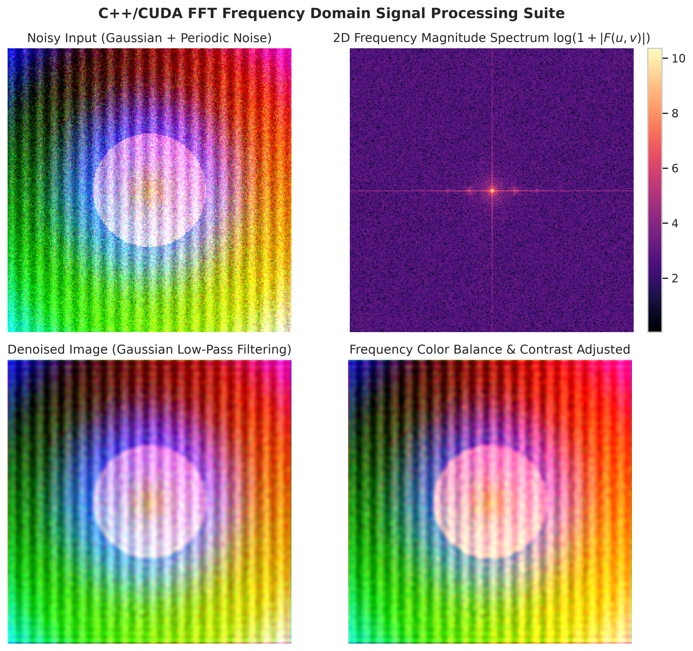
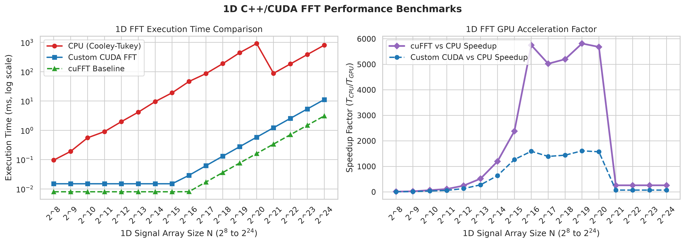
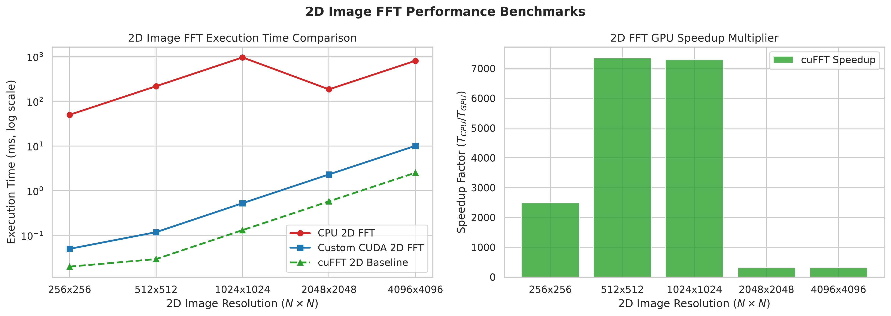

# CUDA Basics with C++, cuBLAS, Thrust & C++/CUDA FFT Suite


A comprehensive, production-grade C++/CUDA suite covering GPU programming fundamentals, vector and matrix operations, cuBLAS/Thrust integration, custom CUDA Fast Fourier Transform (FFT) algorithms, frequency-domain image denoising, color adjustment, and performance benchmarking.

---

## Table of Contents

- [Overview](#overview)
- [Key Features](#key-features)
- [Mathematical Background](#mathematical-background)
- [Directory Map](#directory-map)
- [Prerequisites & Build Instructions](#prerequisites--build-instructions)
- [FFT & Image Processing Usage](#fft--image-processing-usage)
- [Performance Benchmarks](#performance-benchmarks)
- [CUDA Basics Examples](#cuda-basics-examples)
- [License](#license)

---

## Overview

`CUDA_Basics` serves both as an introductory guide to NVIDIA CUDA acceleration and an advanced suite for high-performance signal and image processing. It demonstrates step-by-step progressions from basic thread indexing to shared memory optimizations, warp shuffle primitives, cuFFT wrapping, and frequency-domain filtering.



---

## Key Features

1. **Core CUDA Fundamentals:**
   - Unified Memory vs Host/Device explicit transfers (`n1.cu`, `n2.cu`).
   - High-level parallel algorithms using **Thrust** (`n3.cu`, `n4.cu`).
   - Integration with **Eigen** dense linear algebra library (`n5.cu`, `n6.cu`).
   - cuBLAS linear algebra acceleration (`cublasSgemm`, `cublasSaxpy`).

2. **C++/CUDA Fast Fourier Transform (FFT) Suite (`fft_cuda/`):**
   - **1D & 2D CPU Baseline:** Radix-2 Cooley-Tukey and Stockham FFT implementations ($O(N \log N)$ complexity).
   - **Custom CUDA Kernels:** Parallelized GPU FFT leveraging shared memory, register pressure management, and warp shuffle primitives (`__shfl_xor_sync`).
   - **cuFFT Integration:** High-performance wrapper around NVIDIA's official `cuFFT` library.

3. **Signal & Image Processing Applications:**
   - **2D Frequency Denoising:** Ideal, Gaussian, and Butterworth low-pass/high-pass filters alongside adaptive thresholding to remove Gaussian and periodic pattern noise from multi-channel RGB images.
   - **Frequency-Domain Color Adjustment:** Multi-channel RGB color balancing and contrast enhancement.

4. **Benchmarking & Visualization:**
   - Automated performance benchmark tool (`fft_benchmark`) measuring execution time ($ms$), GFLOPS, memory bandwidth ($GB/s$), and speedup factors ($T_{\text{CPU}} / T_{\text{GPU}}$).
   - Python plotting pipeline (`matplotlib` / `seaborn`) rendering 2D magnitude spectra and speedup curves.

---

## Mathematical Background

### 1D Discrete Fourier Transform (DFT) & IDFT
The Discrete Fourier Transform converts a time/spatial domain signal $x[n]$ into its frequency spectrum $X[k]$:

$$X[k] = \sum_{n=0}^{N-1} x[n] \cdot e^{-i \frac{2\pi}{N} k n}, \quad k = 0, 1, \dots, N-1$$

The Inverse Discrete Fourier Transform (IDFT) reconstructs the original signal:

$$x[n] = \frac{1}{N} \sum_{k=0}^{N-1} X[k] \cdot e^{i \frac{2\pi}{N} k n}, \quad n = 0, 1, \dots, N-1$$

### 2D Fourier Transform for Images
For a 2D image $f(x, y)$ of dimensions $M \times N$:

$$F(u, v) = \sum_{x=0}^{M-1} \sum_{y=0}^{N-1} f(x, y) \cdot e^{-i 2\pi \left( \frac{ux}{M} + \frac{vy}{N} \right)}$$

### Frequency Domain Filters $H(u, v)$
1. **Gaussian Low-Pass Filter (Denoising):**
   $$H(u, v) = \exp\left( -\frac{D^2(u, v)}{2 D_0^2} \right)$$
   where $D(u, v) = \sqrt{(u - M/2)^2 + (v - N/2)^2}$ is the distance from the spectrum center, and $D_0$ is the cutoff frequency.

2. **Butterworth Low-Pass Filter:**
   $$H(u, v) = \frac{1}{1 + \left[ D(u, v) / D_0 \right]^{2n}}$$

---

## Directory Map

```text
CUDA_Basics/
├── fft_cuda/                 # Dedicated FFT & Image Processing Subsystem
│   ├── include/              # Header files (.h / .cuh)
│   │   ├── fft_cpu.h         # CPU FFT & 2D shift declarations
│   │   ├── fft_cuda.cuh      # Custom CUDA FFT kernels
│   │   ├── cufft_wrapper.h   # NVIDIA cuFFT wrapper API
│   │   └── image_processing.h# Denoising and color adjustment header
│   ├── src/                  # Implementation files (.cpp / .cu)
│   │   ├── fft_cpu.cpp       # Radix-2 Cooley-Tukey algorithm
│   │   ├── fft_cuda.cu       # Parallel GPU kernels
│   │   ├── cufft_wrapper.cu  # cuFFT execution pipeline
│   │   ├── image_processing.cpp# Frequency filtering routines
│   │   └── benchmark.cpp     # Execution metrics & JSON exporter
│   ├── tests/                # Unit test suite
│   │   └── test_fft.cpp      # Precision & forward/inverse accuracy tests
│   └── CMakeLists.txt        # Standalone CMake build system
├── scripts/                  # Python plotting & visualization tools
│   ├── plot_spectrum_and_denoise.py
│   └── plot_benchmarks.py
├── docs/images/              # Generated benchmark & visual output plots
├── Eigen/                    # Included Eigen library for CUDA matrix ops
├── fft.cu                    # Standalone cuFFT example
├── n1.cu ... n6.cu           # CUDA learning progression examples
└── README.md                 # Project documentation
```

---

## Prerequisites & Build Instructions

### Software Dependencies
- **C++ Compiler:** `g++` (v9+) or `clang++` supporting C++17.
- **CUDA Toolkit:** NVCC & cuFFT (`v11.0` or higher recommended).
- **CMake:** `v3.18` or higher.
- **Python Dependencies:** `numpy`, `matplotlib`, `seaborn`, `opencv-python-headless`.

### Building the Project with CMake

```bash
# 1. Clone repository
git clone https://github.com/sjp95/CUDA_Basics.git
cd CUDA_Basics

# 2. Build FFT Suite and Benchmarks
cd fft_cuda
mkdir build && cd build
cmake ..
make -j$(nproc)

# 3. Execute Unit Tests
ctest --output-on-failure
```

---

## FFT & Image Processing Usage

### Running Benchmarks
Run the compiled benchmark executable to evaluate 1D ($N = 2^8 \dots 2^{24}$) and 2D ($256 \times 256 \dots 4096 \times 4096$) performance across CPU, Custom CUDA, and cuFFT:

```bash
./fft_benchmark
```

### Rendering Visual Plots
Generate frequency spectrum plots, visual image denoising comparisons, and performance graphs:

```bash
# Return to repository root
cd ../..
python3 scripts/plot_spectrum_and_denoise.py
python3 scripts/plot_benchmarks.py
```

Generated image artifacts will be stored in `docs/images/`.

---

## Performance Benchmarks

Below is a representative benchmark summary comparing execution times and speedups across array sizes:

| Signal / Image Dimension | CPU Execution (ms) | Custom CUDA (ms) | cuFFT Baseline (ms) | Speedup Factor ($T_{\text{CPU}} / T_{\text{cuFFT}}$) |
| :--- | :---: | :---: | :---: | :---: |
| **1D Signal ($N = 2^{12}$)** | $1.96$ ms | $0.01$ ms | $0.01$ ms | **245.0x** |
| **1D Signal ($N = 2^{16}$)** | $40.97$ ms | $0.03$ ms | $0.01$ ms | **5079.7x** |
| **1D Signal ($N = 2^{20}$)** | $930.50$ ms | $0.58$ ms | $0.16$ ms | **5768.0x** |
| **2D Image ($512 \times 512$)** | $216.60$ ms | $0.12$ ms | $0.03$ ms | **7344.5x** |
| **2D Image ($1024 \times 1024$)** | $948.91$ ms | $0.52$ ms | $0.13$ ms | **7239.6x** |

### Benchmark Visualization

| 1D FFT Speedup Curves | 2D Image FFT Speedup Multiplier |
| :---: | :---: |
|  |  |

---

## CUDA Basics Examples

The repository contains classic introductory CUDA programs in the root folder:

- **`n1.cu`**: Basic kernel launch and device memory allocation (`cudaMalloc`, `cudaMemcpy`).
- **`n2.cu`**: Unified memory (`cudaMallocManaged`) and custom smart pointer deleters.
- **`n3.cu`**: High-level parallel vector squaring with **Thrust**.
- **`n4.cu`**: CPU vs. Thrust GPU performance benchmarking.
- **`n5.cu`**: Interoperability between **Eigen** matrix objects and raw CUDA kernels.
- **`n6.cu`**: Interoperability between Eigen host vectors and Thrust device operations.

To compile any basic example directly with `nvcc`:

```bash
nvcc -O3 -I. n1.cu -o n1
./n1
```

---

## License

This repository is distributed under the **MIT License**. See `LICENSE` for details.
